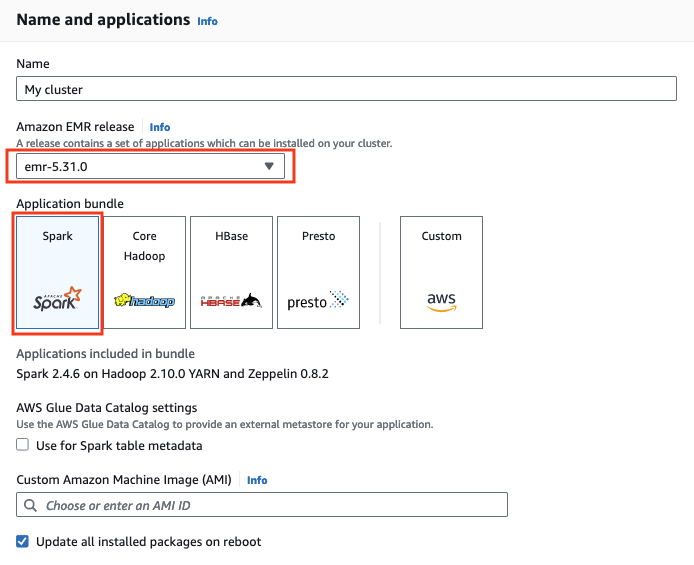
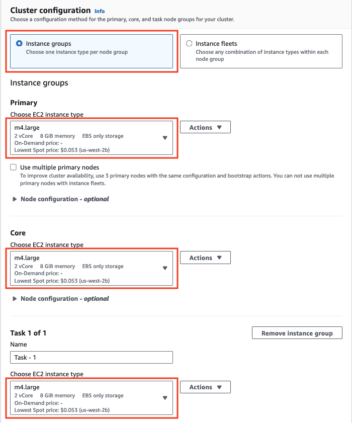
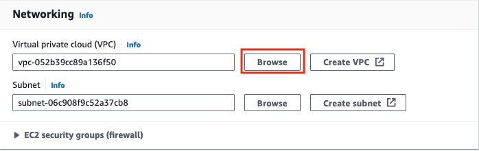
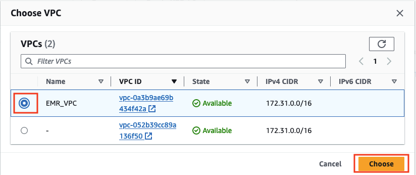
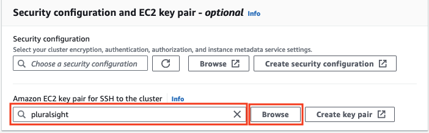
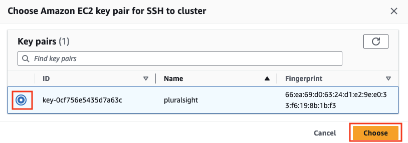
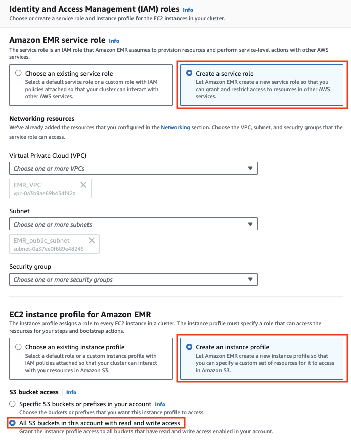
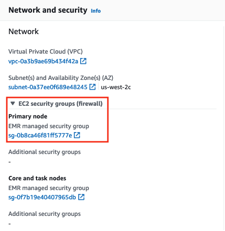

## [Transform Data Using Apache Spark on Amazon EMR](https://app.pluralsight.com/labs/play/d49996a8-5a35-4b78-99a0-592e025fd6d9/task/1)

### Step 1: Configure a Subnet for EMR Cluster

Globomantics is an analytics firm that processes raw data/logs to reap rich insights. Your role as a Data Engineer is to pre-process/massage data, so that the analytics team can use the data for further data modelling. You will use the Spark ETL stack on Amazon EMR cluster to transform the data, in this challenge you will set up a subnet that will be used by Amazon EMR cluster.

1. Log in to the AWS Management Console using the provided credentials.

2. Use the search bar at the top of the page to navigate to the **VPC** service.

3. From the left navigation pane select **Your VPCs**, and then **Create VPC**.

4. In the **Name tag** field, enter `EMR_VPC`.

5. Under **IPv4 CIDR block** enter `172.31.0.0/16` and click on **Create VPC**.


  Shortly afterwards you'll see a green notification appear at the top that says you successfully created a VPC.

6. In the left panel, click on **Internet Gateways** and then click on **Create internet gateway**.

7. Under **Name tag** enter the name `EMR_IGW` and click on **Create internet gateway**.

8. Click on **Actions**, select **Attach to VPC**, under available VPCs select the VPC ending with the name `EMR_VPC` and click on **Attach internet gateway**.

9. In the left panel click on **Route Tables**, select the **Route table ID** whose **VPC ID** ends with the name **EMR_VPC**, select the tab **Routes** and click on **Edit routes**.

10. Click on **Add route**, under Destination enter `0.0.0.0/0`, under **Target** the select **Internet Gateway** with the name ending **EMR_IGW** and click on **Save changes**.

11. In the left panel click on **Subnets**, click on **Create subnet**, under **VPC ID** select the VPC ending with the name **EMR_VPC**, under **Subnet name** enter the name as `EMR_public_subnet`.  Select the **Availability Zone** as **us-west-2c**, under **IPv4 CIDR** block enter `172.31.0.0/20` and then click on **Create subnet**.

You will observe the message highlighted in green that **You have successfully created** 1 subnet with your subnet id and you will find your subnet state as **Available** in green. You have created a public subnet which is a subnet that's associated with a route table that has a route to an Internet gateway. This connects the VPC to the internet and to AWS EMR cluster which we will create in the next challenge.

### Step 2: Configure an Amazon EMR Cluster to Run Spark Jobs

In this challenge you will create an Amazon EMR cluster to run the data engineering jobs using Spark stack

1. Use the search bar at the top of the AWS console to navigate to the **EMR** service.

2. Click on **Create cluster**.

3. Under **Amazon EMR Release** select **emr-5.31.0**.



4. Under **Cluster Configuration** section, change each Instance type (Primary, code and Task) to **m4.large** (click the dropdown).



5. In **Networking** section click the **Browse** button infront of **Virtual private cloud (VPC)** field and select the **VPC** ending with the name **EMR_VPC**. Its subnet will be selected automatically in the **EC2 Subnet** dropdown.




6. In the **Security configuration and EC2 key pair - optional** section, set the **Amazon EC2 key pair for SSH to the cluster** to pluralsight.




7. In the **Identity and Access Management (IAM) roles** section, choose **Create a service role** and in the **EC2 instance profile for Amazon EMR**, choose **Create an instance profile** and then select **All S3 buckets in this account with read and write access** under **S3 bucket access**


9. Click **Create cluster**. The cluster should take 5-10 minutes to start, but could take longer. Wait until the cluster state changes from **Starting** to **Waiting**. The status will change from **Starting** to **Running** before it reaches **Waiting**.

10. Under the **Network and security** section you will find **EC2 security groups (firewall)**, expand it and look for **Primary node**. Click on the link below that **EMR managed security group**, which will open a new tab. In the new tab, you will see **Security group name** as **ElasticMapReduce-master**, then go to the **Inbound rules** tab and click on **Edit inbound rules**. Scroll down and click **Add rule**.



11. Set the **Type** as **SSH**, change the **Source type** from **Custom** to **Anywhere**.

12. Click **Save rules**, then you can close that tab and go back to the EMR Cluster page.

You will observe your cluster in the **Waiting** state. In the **Network and hardware** section you will see your nodes are running. You will use the master node to run your spark jobs and apply data transformations which will coordinate with the slave nodes to execute the job in the distributed cluster environment and fetch the results.

### Step 3: Run Spark Jobs for Data Transformation

In this challenge you will execute Spark Batch Job for Data Transformation in the Amazon EMR Cluster you created in the previous challenge.

1. On the EMR cluster page, under the **Summary** section, copy the IP address next to **Master public DNS**.

2. Use the search bar at the top of the page to navigate to the **EC2** service.

3. Select **Instances (running)** and then paste the IP address which you copied in step 1 into the **Filter instances** search bar, then hit enter/return.

4. Select the instance and click on **Connect**. On the **EC2 Instance Connect** tab, change the **Username** to `ec2-user`.

5. Click **Connect**.

6. In the EC2 instance shell run the command `sudo yum update -y`  and then run `sudo yum install git -y`.

7. The dataset you'll be using has people from different age groups across countries. The spark transformation job will filter for people with age less than 40. To run the spark job you will clone the code with this command:

```sh
git clone https://github.com/ps-interactive/lab_aws_transform-data-using-apache-spark-on-amazon-EMR.git
```
8. Change directory:

```sh
cd lab_aws_transform-data-using-apache-spark-on-amazon-EMR/HelloDataset/target/scala-2.11
```

9. Go back to the tab with the AWS console, then navigate to the **S3** service.

10. Click on **Create bucket** and enter a unique bucket name of your choice. Uncheck **Block all public access** and check **I acknowledge that the current settings might result in this bucket and the objects within becoming public** and then click on **Create bucket**.

11. Go back to your EC2 instance shell and, to copy the data file inside your bucket, run the below command after replacing the `<yourbucketname>` placeholder (at the end) with your bucket's name:

```sh
aws s3 cp /home/ec2-user/lab_aws_transform-data-using-apache-spark-on-amazon-EMR/HelloDataset/data/sample.csv s3://<yourbucketname>/ .
```

12. Again replace the bucket name placeholder, then run the command:

```sh
spark-submit ./hellodataset_2.11-0.1.jar s3://<yourbucketname>/sample.csv
```

This will execute the spark job on the dataset you copied to your S3 bucket (sample.csv) .

In the terminal you will observe in the final output a line reading `INFO HelloDataSet$: DataSet: (United States,4),(United Kingdom,1),(Canada,2)` which gives you the count of people across geographies with age less than 40. So basically, spark ran an internal data transformation/filtration job which applied filters to the dataset loaded in S3 bucket to yield the desired outcome.