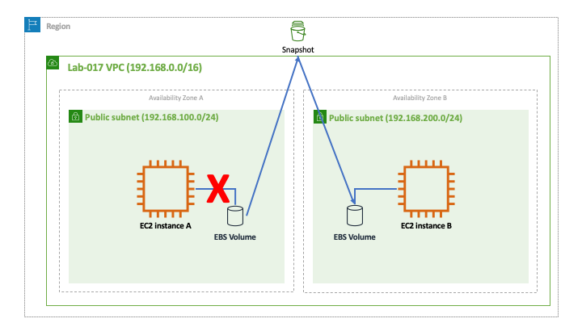
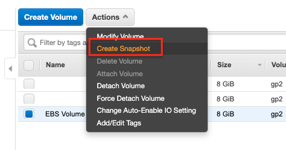
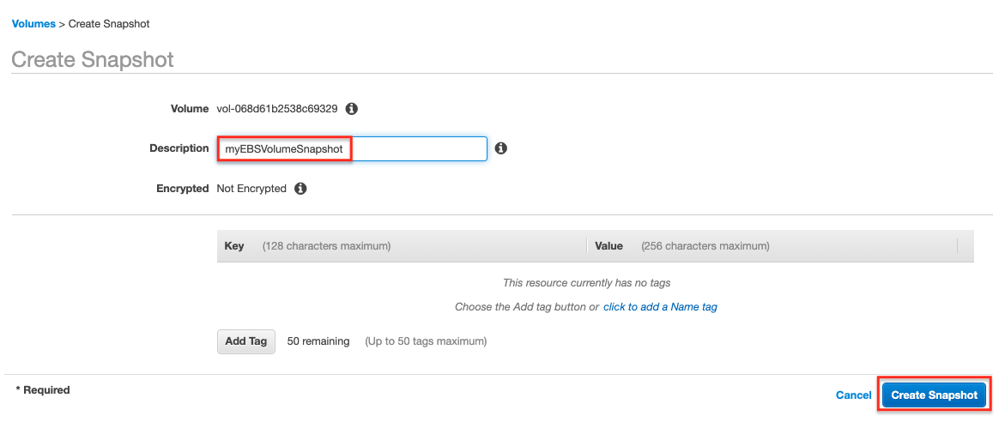
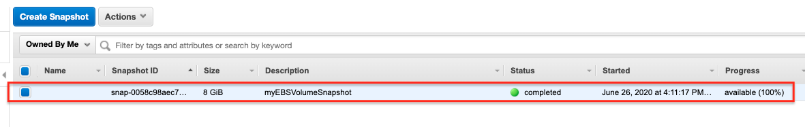
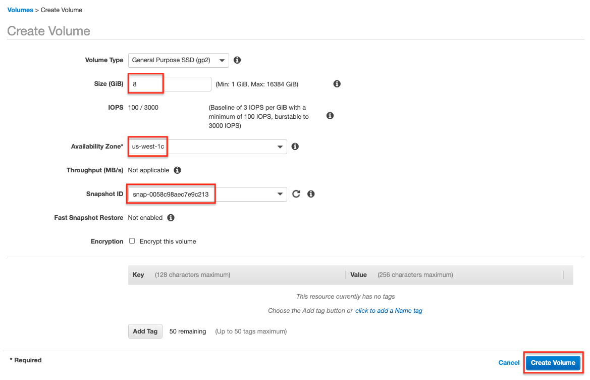

## Snapshot an EBS Volume

Amazon Elastic Block Store (EBS) provides persistent block storage for Amazon EC2 instances. EBS volumes are designed to be highly available and durable, making them ideal for storing critical data that needs to persist beyond the life of an EC2 instance. One of the powerful features of EBS is the ability to take snapshots of your volumes. Snapshots are incremental backups that capture the state of an EBS volume at a specific point in time. These snapshots can be used to create new EBS volumes, even in different Availability Zones (AZs), which is crucial for data migration, disaster recovery, and cross-region backups.

In this lab, you will learn how to create a snapshot of an EBS volume, use that snapshot to create a new volume in a different AZ, and attach the new volume to an EC2 instance. This process is particularly useful when you need to move data between AZs, ensuring that your application remains resilient and highly available across different failure domains.

## Why Snapshot an EBS Volume?

-   **Data Migration Across AZs:**  Snapshots allow you to easily move data between different AZs by creating new volumes from the snapshot in the target AZ.
-   **Backup and Restore:**  Snapshots provide a way to back up your EBS volumes, ensuring that you can restore your data in the event of failure or data corruption.
-   **Cost Efficiency:**  Snapshots are incremental, meaning only the changed blocks are stored, which reduces storage costs while still allowing you to create full backups.
-   **Cross-Region Replication:**  Snapshots can be copied across regions, enabling disaster recovery strategies that span multiple geographical locations.
-   **Encryption:**  Snapshots allow you to easily create encrypted copies of unencrypted volumes, adding a layer of security to your data.

By the end of this lab, you will have hands-on experience with creating and managing EBS snapshots, moving data between AZs, and using snapshots to create new EBS volumes. This will give you a deeper understanding of how to leverage EBS snapshots for various data management scenarios in AWS.

## Goal
This lab's goal is similar to [Lab 9: Moving an EBS Volume Between EC2 Instances](../lab-9-moving-an-ebs-volume-between-ec2-instances) but because we want to move a volume from one AZ to another we will have to first create a snapshot of the volume and then create a new volume from the snapshot.

## Architecture Diagram

## Overview

Create two EC2 instances in different AZs. Create an EBS volume and attach it to one of them. Create some files in the volume and then terminate the the EC2 that had the attached volume. Then follow the steps.

### Step 1 - Create an Snapshot of an EBS Volume

Go to *Elastic Block Store - Snapshots*.

Verify that your snapshot was successfully created at *Snapshots*. You might want to copy the *Snapshot ID* to use it on the next step. Once your snapshot is created you can delete the EBS volume.

### Step 2 - Create an EBS Volume from a Snapshot

Create a new volume from the snapshot that you created in the previous step. Make sure your volume is created on the other AZ.

### Step 3 - Attach EBS Volume

Attach the EBS volume created from the snapshot to the EC2 instance running on the other AZ.

## Test and Validation

Connect to the EC2 instance running on the other AZ, mount the EBS volume and see if you can access the files created earlier.

## Challenge

Try encrypting the EBS volume that you will be creating from the snapshot. Use the following steps:

* create a snapshot from the EBS volume,
* copy the (unencrypted) snapshot to a new (now encrypted) snapshot, and
* create an EBS volume from the encrypted snapshot.
