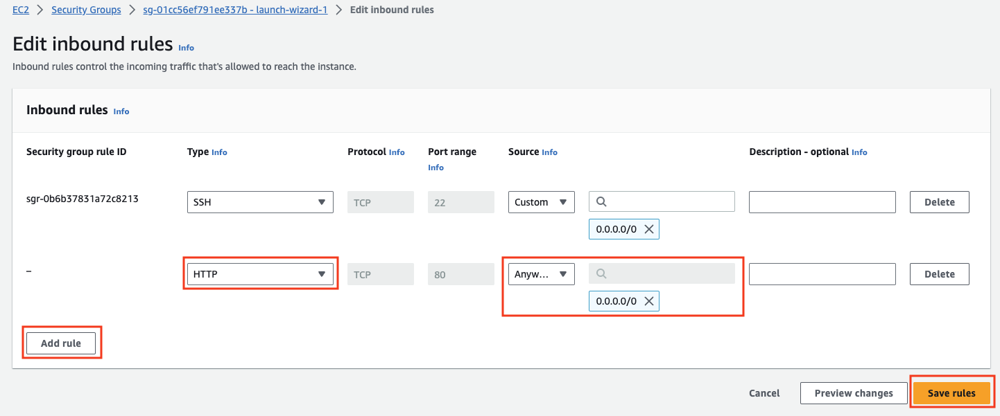
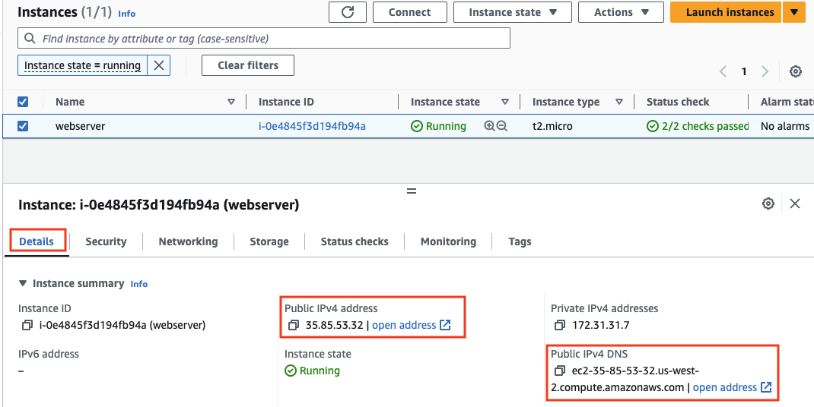

## Launch and Configure an EC2 Instance with the Wizard

This final step of the EC2 instance setup involves installing and configuring the Nginx web server, adding necessary security group rules, and deploying a website template. Nginx is a popular, high-performance web server that can be used to serve web pages to users over the internet. By setting up Nginx on your EC2 instance, you'll be able to host and serve a static website directly from your instance.

## Why Install Nginx on Your EC2 Instance?

Installing Nginx on your EC2 instance provides several key advantages:

-   **Web Server Capability:**  Nginx allows you to serve web pages, making it possible to host websites, web applications, or serve as a reverse proxy for your backend services.
-   **High Performance:**  Nginx is known for its efficiency and ability to handle a large number of concurrent connections, making it ideal for high-traffic websites.
-   **Ease of Use:**  Setting up Nginx is straightforward, and it integrates seamlessly with your EC2 instance, allowing you to quickly get a web server up and running.
-   **Flexibility:**  Nginx can be configured to serve static content, load balance traffic, or even serve as a content cache, making it versatile for various use cases.

By completing this setup, you'll transform your EC2 instance into a fully functioning web server capable of serving a website to users worldwide. This setup also includes configuring the necessary security group rules to allow HTTP traffic, ensuring that your site is accessible to visitors.

### Last step: Install Nginx webserver

- install and start nginx using below commands

```bash
sudo yum install nginx
sudo systemctl status nginx
sudo systemctl start nginx
```

- Add the **HTTP** port to **security group** from EC2 console.
  - Go to the EC2 console and make the below changes. Click on the listed security group

    

  - Click on **Edit inbound rules**

    

  - Add the **HTTP** port and select **Anywhere-IPv4**. Click on **Save rules**

    

- Access the public IP using **http://{public-ip-or-public-dns}** of the machine.



- Nginx refers to `/usr/share/nginx/html` folder for its html files. run the below commands in the terminal to download a website template and install it in nginx.

```sh
# get inside the folder
cd  /usr/share/nginx/html
# download the template
sudo wget https://www.free-css.com/assets/files/free-css-templates/download/page295/edgecut.zip
# unzip the template
sudo unzip edgecut.zip
```

- Open browser **http://{public-ip-or-public-dns}/edgecut-html**, to view the installed website.
