## An HTTP Load Balancer

This lab is designed to guide you through the process of setting up an HTTP Load Balancer using an AWS Application Load Balancer (ALB) to distribute incoming web traffic across two EC2 instances deployed in different Availability Zones. By the end of this lab, you will have a functional load-balanced architecture that can handle web traffic efficiently and ensure high availability for your application.

### Why Use an Application Load Balancer?

-   **Traffic Distribution:**  An Application Load Balancer automatically distributes incoming application traffic across multiple targets, such as EC2 instances, ensuring that no single instance is overwhelmed by traffic.
-   **High Availability:**  By distributing traffic across multiple instances in different Availability Zones, the ALB ensures your application remains available even if one instance or AZ fails.
-   **Scalability:**  The ALB supports automatic scaling, allowing your application to handle varying amounts of traffic effectively.
-   **Enhanced Security:**  The ALB integrates with AWS security services, such as AWS WAF (Web Application Firewall), to provide additional layers of protection for your application.

### Lab Objectives

-   Set up a Virtual Private Cloud (VPC) with two public subnets in different Availability Zones.
-   Deploy two EC2 instances in separate subnets, each running a simple web server.
-   Configure an Application Load Balancer to distribute HTTP requests across the two instances.
-   Test the load balancer to ensure it distributes traffic correctly and handles instance failures gracefully.

## Goal
The goal of this lab is to illustrate how to use an [Application Load Balancer](https://docs.aws.amazon.com/elasticloadbalancing/latest/application/application-load-balancers.html) to distribute requests over two web servers running on distinct Availability Zones. [Here](../images/ELB.png) is a mind map of ELB (Elastic Load Balancing).

## Architecture Diagram
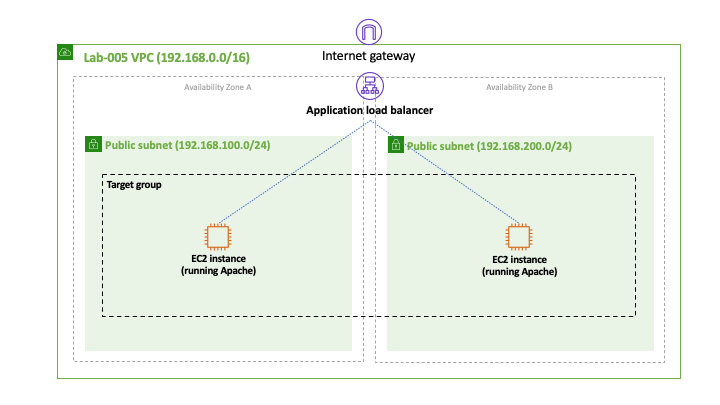

## Overview
AWS Elastic Load Balancing (ELB) service supports three types of load balancers:
* Application Load Balancer,
* Network Load Balancer, and
* Classic Load Balancer.

As the name suggests, the *Application Load Balancer* works at the application layer and understands protocols such as HTTP. This gives the load balancer the ability to support routing rules based on the URL or the host field in the HTTP header, for example.

### Step 1 - Create VPC and Subnets
Create a new VPC with the *Name tag* lab-005 and the *IPv4 CIDR block* 192.168.0.0/16. Then create two public subnets in distinct availability zones of your VPC.  Make sure to set the CIDR IPv4 block correctly to each subnet according to the ranges specified in the architecture diagram. You can use tags subnet-A and subnet-B for the subnets.

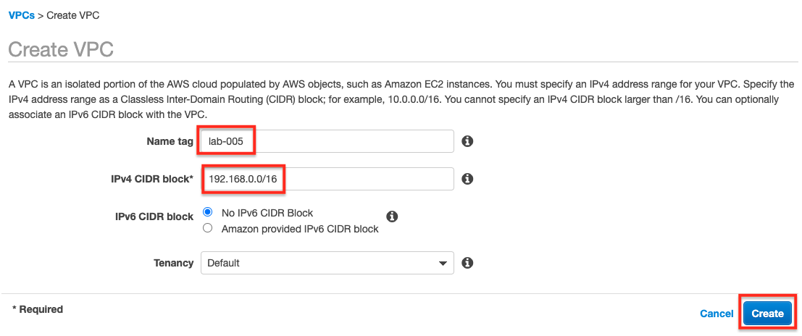
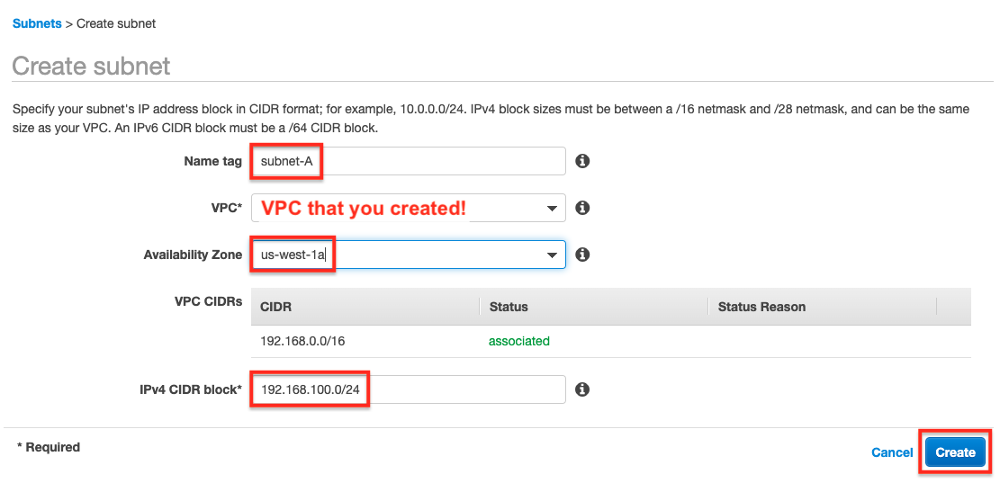
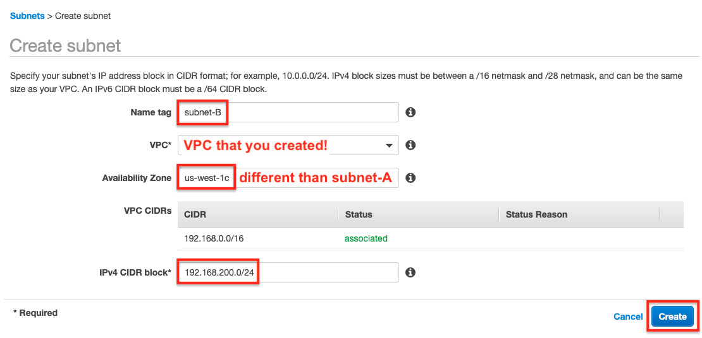
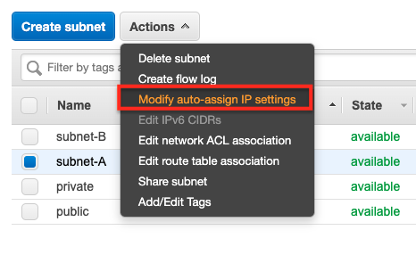
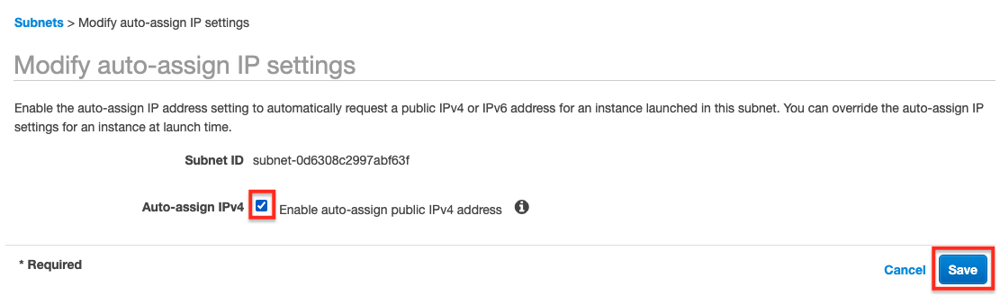
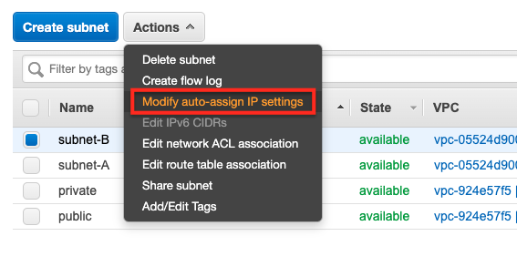
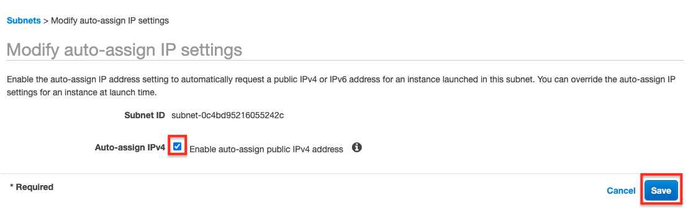

### Step 2 - Create an Internet Gateway
Create an [Internet gateway](https://docs.aws.amazon.com/vpc/latest/userguide/VPC_Internet_Gateway.html) with the *Name tag* lab-005 and attach it to lab-005 VPC. This procedure is described in detail in step 2 of [lab-3-a-single-ec2-instance-in-a-private-subnet-bastion-host](../lab-3-a-single-ec2-instance-in-a-private-subnet-bastion-host).

### Step 3 - Modify the Main Route Table
Add a default route on your VPC router with a destination to the *Internet gateway* created in the previous step. Go to Subnet Associations and associate both subnets to the Main Route Table.

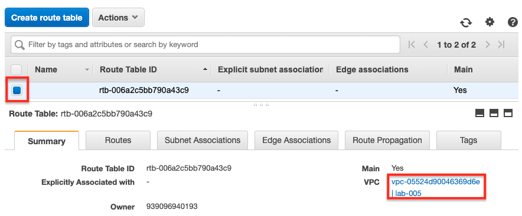
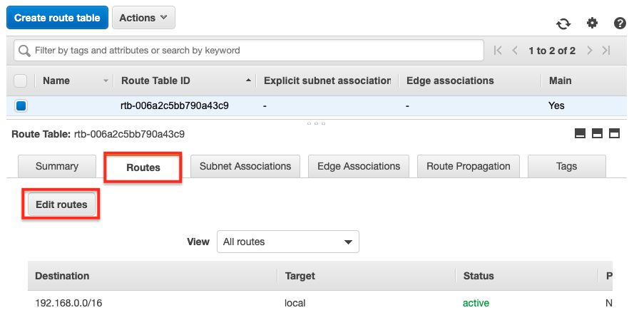
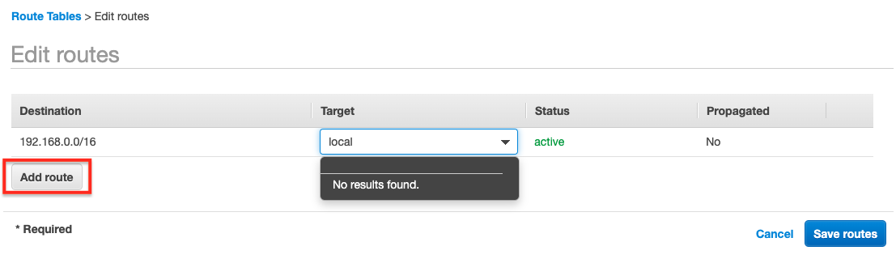
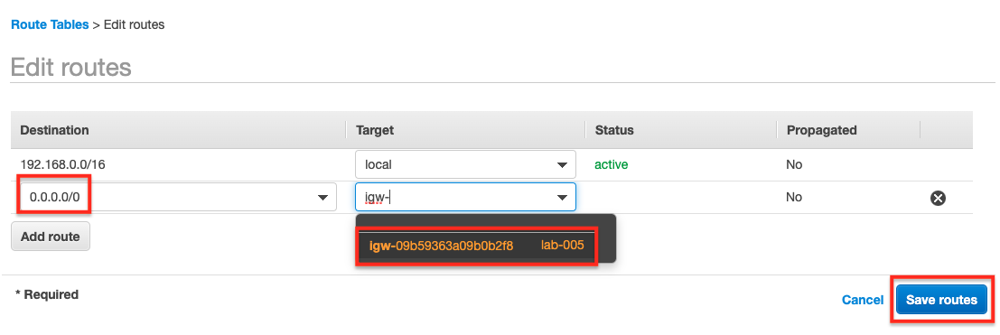

### Step 4 - Launch EC2 Instances
Launch an EC2 instance on each of the public subnets you created in the first step of this lab.

1. You can use *Amazon Linux 2 AMI*.
2. You can choose the *Free tier eligible* instance type.
3. Make sure to set the correct VPC and subnet for each instance; also, use the provided [user-data](files/user-data.sh) to setup an HTTP server on your instances.
4. You can select the suggested storage for your instances.
5. You should add a *Name tag* to help identifying your instances.
6. Both instances should be in a *Security Group* with inbound rules that accept SSH and HTTP traffic.
7. You should secure your instances by creating a *lab-005* key pair.

At this point you should be able to access both instances using a browser an the instances public IP addresses. You should be able to see the hostname of each instance as the index page.

### Step 5 - Create the Application Load Balancer
Follow the procedure described by the screenshots.
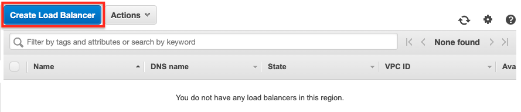
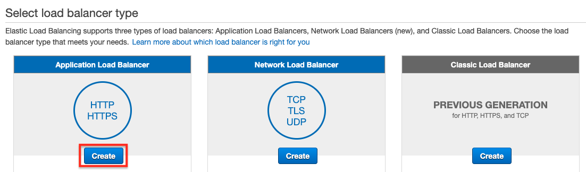
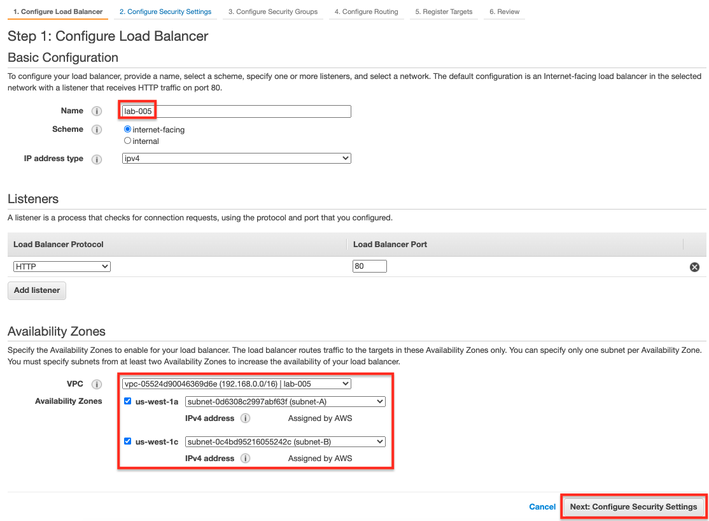
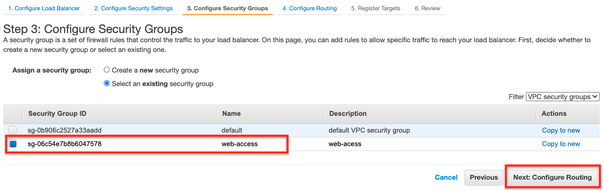
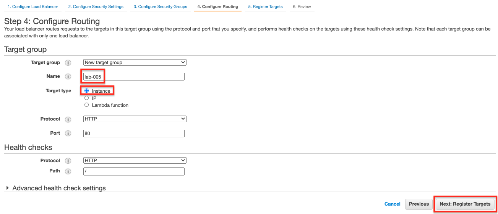
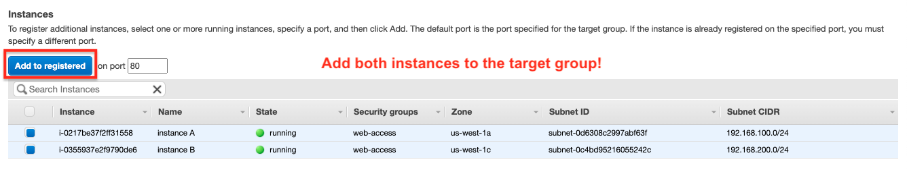
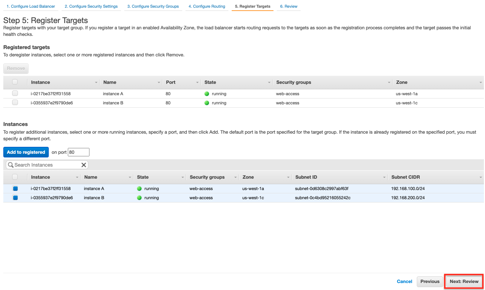
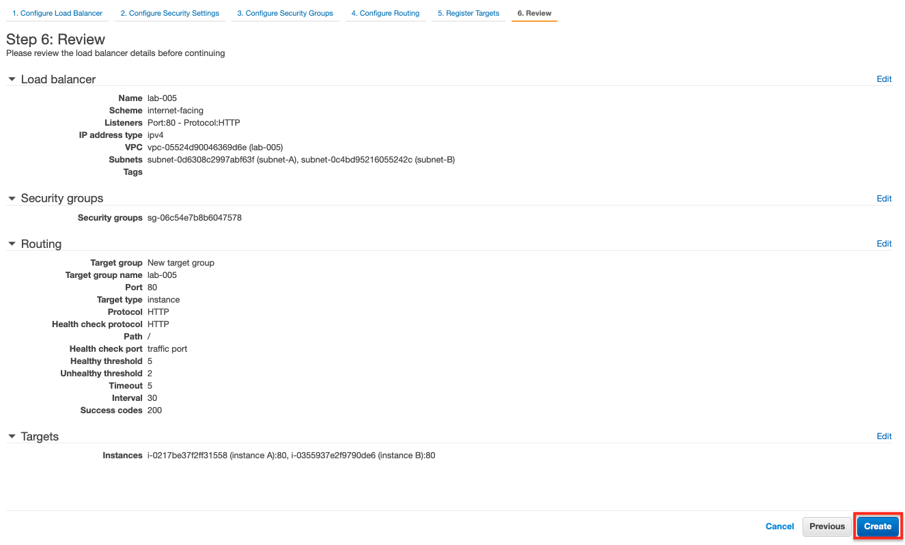
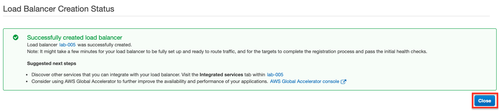

## Test and Validation
Copy the DNS name associated with the load balancer and, using a browser, try to access it. You should be able to see alternate responses (as you refresh the page) of the two instances webpages which proves that the load balancer is working properly by redirecting the request evenly to the two instances.

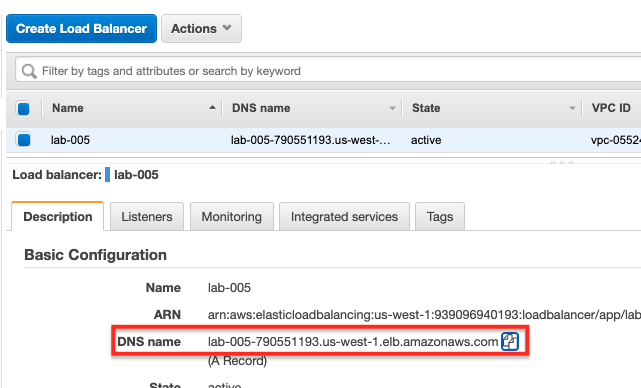

Another test you should do is to stop one of the instances and verify that the load balancer will not send requests to the stopped instance anymore.  
