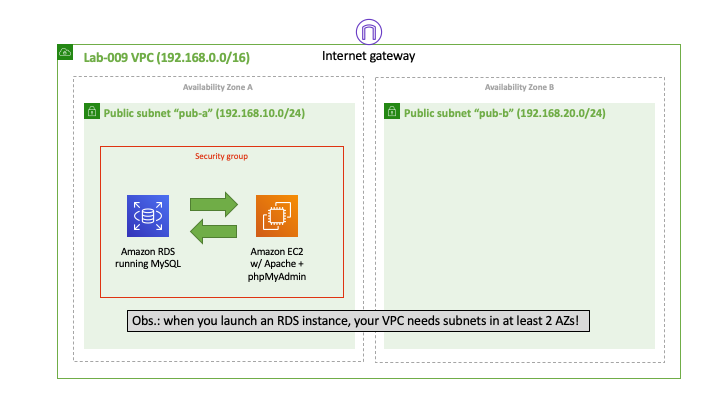
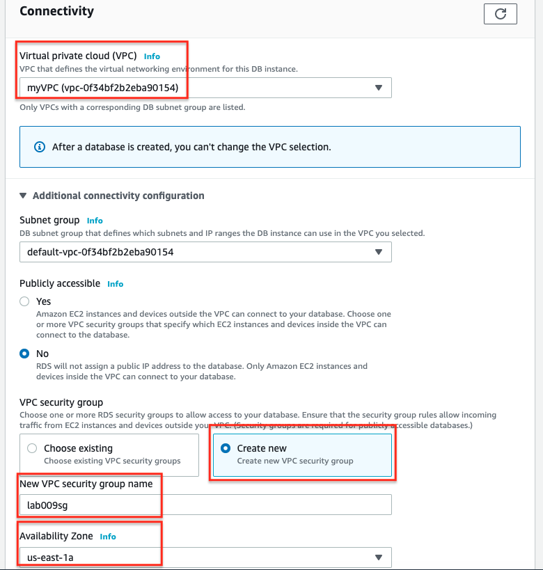
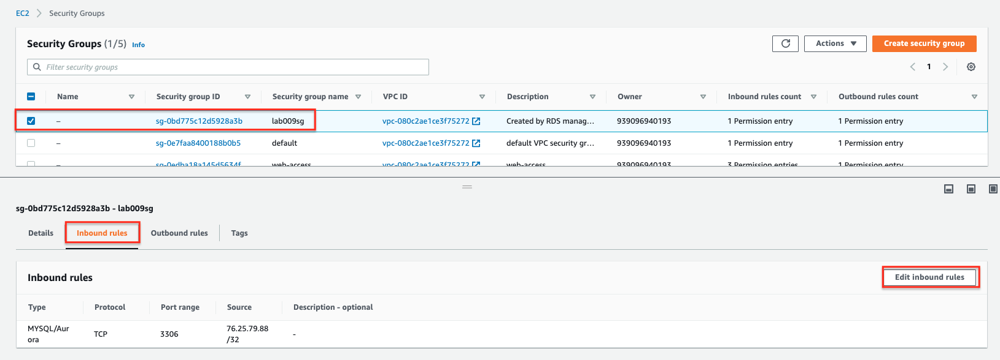
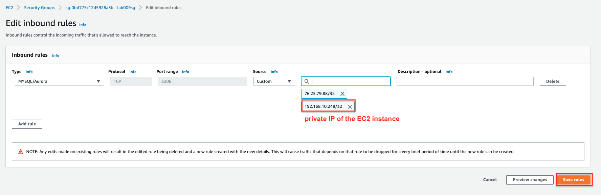
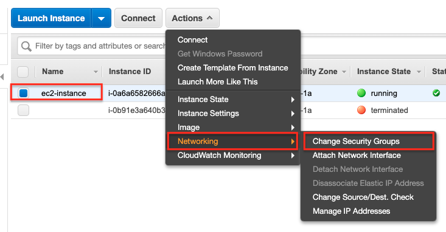
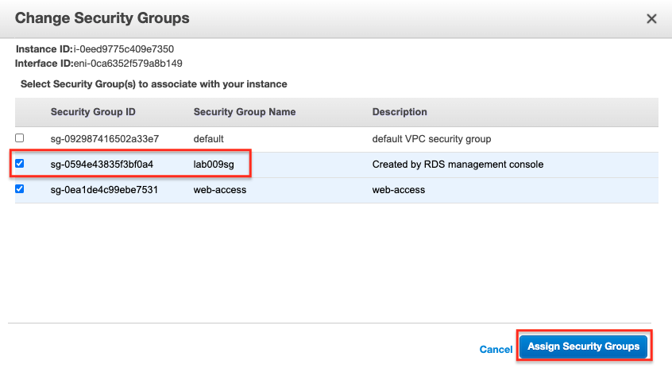
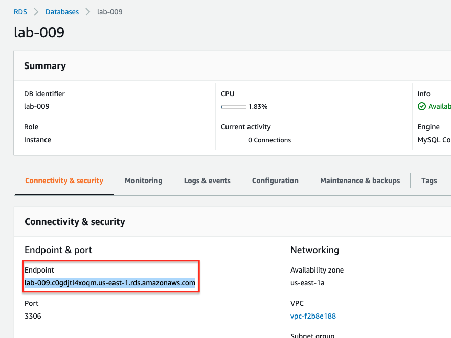
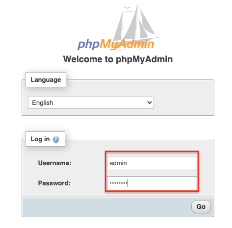

## A Standalone RDS Instance Running MySQL


Amazon Relational Database Service (RDS) is a fully managed relational database service provided by AWS. It simplifies the process of setting up, operating, and scaling a relational database in the cloud. In this lab, you will learn how to launch a standalone RDS instance running MySQL, one of the most popular open-source relational database management systems. The lab will also involve setting up an EC2 instance configured with Apache and phpMyAdmin, a web-based tool that provides an easy-to-use interface for managing MySQL databases.

This hands-on experience will help you understand the basics of deploying and interacting with an RDS instance and how to securely connect it to a web-based administration tool hosted on an EC2 instance. By the end of this lab, you will have a functional MySQL database that you can manage via phpMyAdmin.

## Why Use Amazon RDS?

-   **Managed Service:**  Amazon RDS takes care of routine database tasks such as backups, patching, and scaling, freeing you up to focus on your application.
-   **High Availability:**  RDS supports Multi-AZ deployments, ensuring that your database is highly available and fault-tolerant, though this lab focuses on a single AZ setup for simplicity.
-   **Scalability:**  RDS allows you to scale your database's compute and storage resources easily to meet the demands of your application.
-   **Security:**  RDS integrates with AWS Identity and Access Management (IAM), enabling you to control access to your databases securely.
-   **Cost-Effective:**  With pay-as-you-go pricing and the option to start with the free tier, RDS provides a cost-effective solution for managing relational databases in the cloud.

This lab is designed to give you a practical understanding of how to deploy and manage a MySQL database using Amazon RDS and how to set up a secure connection between the database and a web-based management tool running on an EC2 instance.


## Goal
This lab illustrates how to launch a standalone RDS instance running a MySQL database. An EC2 instance will also be launched to allow access to the database using phpMyAdmin. [Here](../images/RDS.png) is a mind map of RDS.

## Architecture Diagram



## Overview
The Amazon Relational Database Service (Amazon RDS) offers a managed service based on relational databases.  In this lab you will be configuring RDS to use MySQL, an open source database. For simplicity, you will not configure more advanced features available in RDS, such as *multi-az deployment* or *read replicas*. To verify that RDS is working, you will configure an EC2 instance with Apache and phpMyAdmin, a free software tool written in PHP that simplifies administration of a MySQL database over the Web.

### Step 1 - Create a Custom VPC with Two Public subnets

Start this lab by configuring an internet gateway on a custom VPC. Make sure there is a default route for your VPC's internet gateway. Make sure your public subnets are configured in distinct AZs and that auto-assign IPv4 is enabled.

### Step 2 - Launch an RDS Instance

Below are some of the main options you should select:
* Database creation method: Standard Create
* Engine option: MySQL
* Templates: Free tier
* DB instance identifier: lab009
* Master password: 12345678 (not safe but this is just a lab)
* DB instance size: Standard classes
* Storage: default options are fine for this lab
* Multi-az deployment: if you selected the *free tier* template you should not even be able to select *multi-az deployment* options
* Connectivity: set your custom VPC to be the one where your RDS instance will run; in the additional connectivity configuration - VPC security group, choose *Create new* and name it *lab009sg*; finally for the availability zone choose the one suffixed with 1a (or the first option that appears to you)
* Additional configurations: set the initial database name to *lab009* and disable automatic backups



### Step 3 - Launch an EC2 Instance

Configure an EC2 instance in the public subnet in the same AZ where your RDS instance was launched. Use the [user-data](files/user-data.sh). Create a security group that allows SSH and HTTP access to your instance from anywhere.

### Step 4 - Modify RDS's Security Group

Modify the inbound rule of the RDS's security group to enable access from the EC2's instance.




### Step 5 - Apply RDS's Security Group to EC2 Instance

In order for your EC2 instance to be able to access the RDS instance it has to be in the same security group created in step 2.




### Step 5 - Configure phpMyAdmin

* Connect to your EC2 instance via SSH
* Run the following commands (requires privileged access):

```
cd /var/www/html
tar xvf phpMyAdmin-latest-all-languages.tar.gz
rm -rf phpMyAdmin-latest-all-languages.tar.gz
ln -s phpMyAdmin-5.0.2-all-languages phpMyAdmin
cd phpMyAdmin
cp config.sample.inc.php config.inc.php
```

Edit *config.inc.php* and search for a reference to *localhost*. Replace it with your RDS instance endpoint.



## Test and Validation

Open a browser and using the EC2 instance's public IP address, connect to the database via phpMyAdmin.

```
http://<public IP EC2 instance>/phpMyAdmin
```


