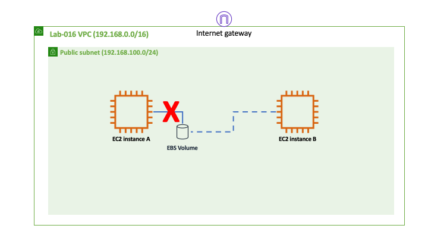
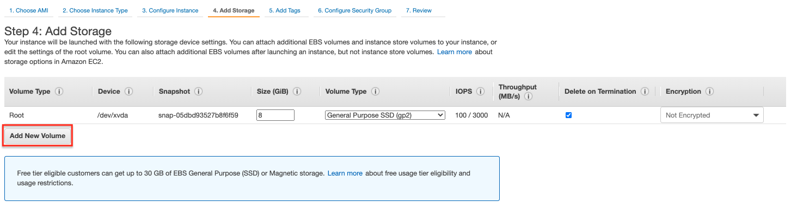
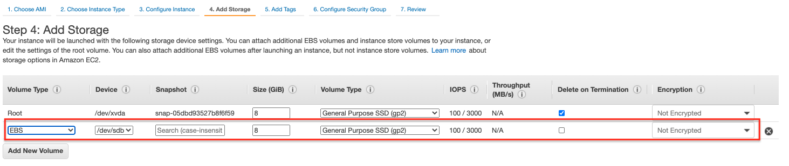
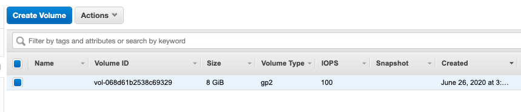
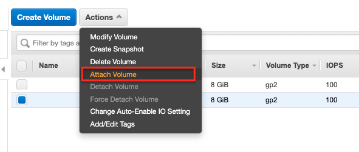
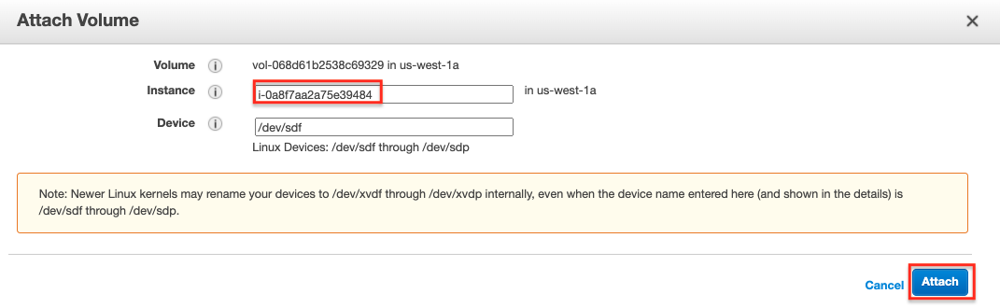

## Moving an EBS Volume Between EC2 Instances

Amazon Elastic Block Store (EBS) is a scalable and high-performance block storage service designed for use with Amazon EC2 instances. One of the key features of EBS is its ability to detach from one EC2 instance and reattach to another, making it possible to move data between instances without any data loss. This capability is particularly useful in scenarios where you need to migrate workloads, backup data, or troubleshoot issues without losing access to critical data.

In this lab, you will learn how to create an EBS volume, attach it to an EC2 instance, and then move that EBS volume to a different EC2 instance. By the end of the lab, you will be able to seamlessly transfer data stored in an EBS volume between two separate EC2 instances.

## Why Move an EBS Volume Between EC2 Instances?

-   **Data Migration:**  Moving an EBS volume allows you to migrate data from one instance to another, which can be useful during upgrades, scaling, or transitioning between environments.
-   **Backup and Recovery:**  If you need to back up data from one instance and restore it to another, moving the EBS volume is an efficient method.
-   **Troubleshooting and Maintenance:**  When performing maintenance or troubleshooting, you might need to temporarily move a volume to another instance for analysis or recovery.
-   **Scaling Applications:**  As your application grows, you might need to move storage volumes to instances with higher capacity or different configurations to handle increased demand.

This lab will guide you through the process of creating an EBS volume, attaching it to an EC2 instance, and then detaching and reattaching it to another instance, ensuring that the data remains intact and accessible throughout the process.

## Goal
The goal of this lab is to illustrate how to move an EBS volume from one EC2 instance to another.

## Architecture Diagram


## Overview

### Step 1 - Create an EBS Volume

During the *Add Storage* step of *Launch Instance*, add a new EBS volume.




### Step 2 - Mount EBS Volume

Connect to the EC2 instance via ssh and run *lsblk* to learn your EBS device's name. For example, the output I got from *lsblk* was:

```
NAME    MAJ:MIN RM SIZE RO TYPE MOUNTPOINT
xvda    202:0    0   8G  0 disk
└─xvda1 202:1    0   8G  0 part /
xvdb    202:16   0   8G  0 disk
```

The device */dev/xvda* is the boot volume, mounted at the root level. The device */dev/xvdb* must be the EBS volume that we created. Run the following commands to format and mount the disk:

```
sudo mkfs.ext4 /dev/xvdb
mkdir data
sudo mount /dev/xvdb data
```

Then use the following commands to create some files in your new disk:

```
sudo touch data/test1.txt
sudo touch data/test2.txt
sudo touch data/test3.txt
```

### Step 3 - Terminate the EC2 Instance

This step illustrates the fact that when you terminate an EC2 instance, non-boot volumes are not deleted by default. Go to *Elastic Block Store - Volumes* and verify that your EBS volume is still available even after the EC2 instance is terminated.



### Step 4 - Attach EBS Volume

Launch a new EC2 instance but this time do not create a new EBS volume. Instead, after your instance is launched, attach the EBS volume created earlier to the EC2 instance.




## Test and Validation

Connect to the new EC2 instance, mount the EBS volume and see if you can access the files created earlier.
