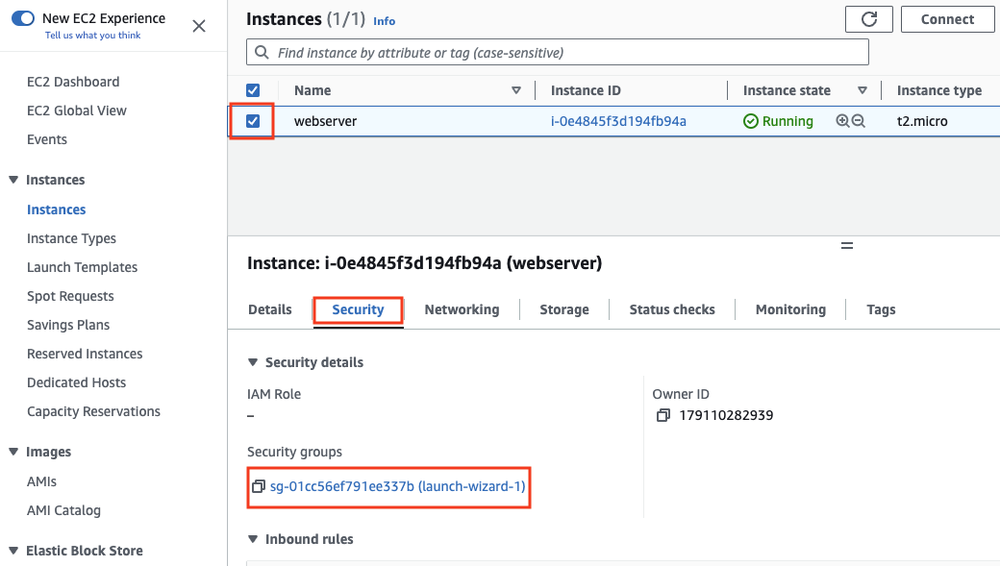
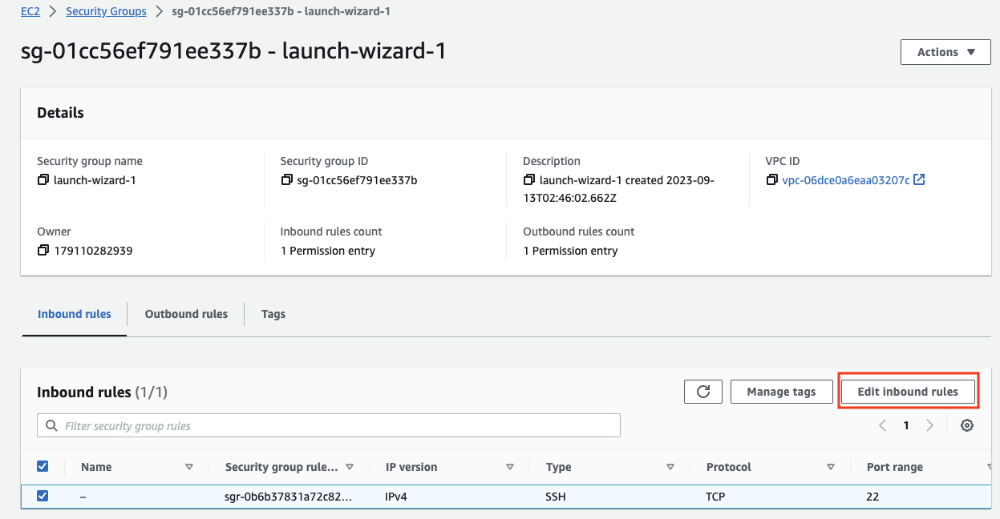
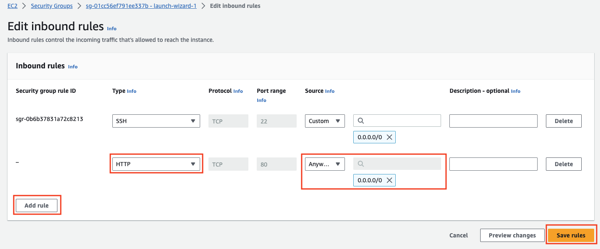
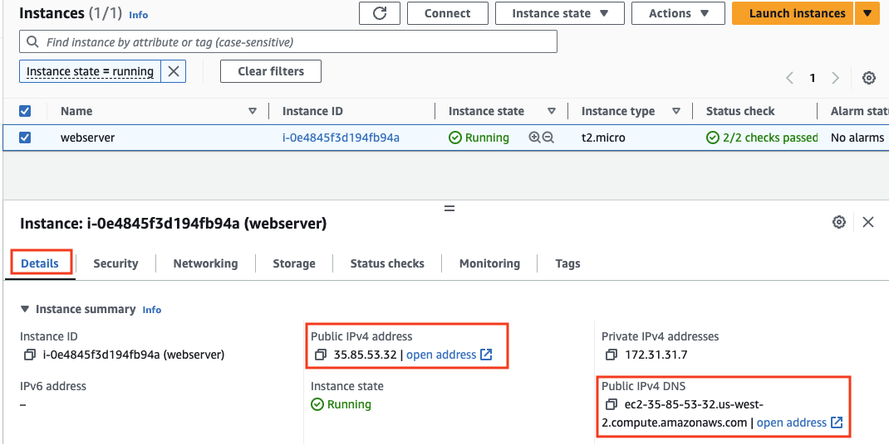

## Launch and Configure an EC2 Instance with the Wizard

### Last step: Install Nginx webserver

- install and start nginx using below commands

```bash
sudo yum install nginx
sudo systemctl status nginx
sudo systemctl start nginx
```

- Add the **HTTP** port to **security group** from EC2 console. 
  - Go to the EC2 console and make the below changes. Click on the listed security group

    

  - Click on **Edit inbound rules**

    

  - Add the **HTTP** port and select **Anywhere-IPv4**. Click on **Save rules**

    

- Access the public IP using **http://{public-ip-or-public-dns}** of the machine.



- Nginx refers to `/usr/share/nginx/html` folder for its html files. run the below commands in the terminal to download a website template and install it in nginx.

```sh
# get inside the folder
cd  /usr/share/nginx/html
# download the template
sudo wget https://www.free-css.com/assets/files/free-css-templates/download/page295/edgecut.zip
# unzip the template
sudo unzip edgecut.zip
```

- Open browser **http://{public-ip-or-public-dns}/edgecut-html**, to view the installed website.